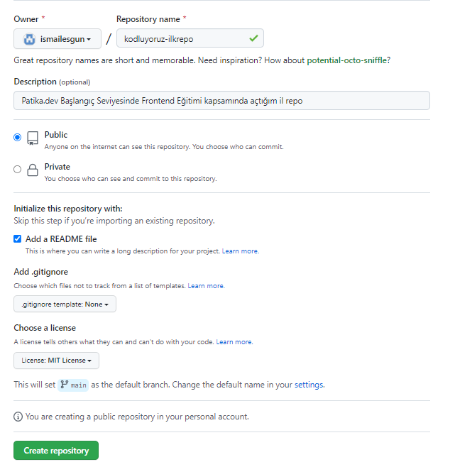

# Kodluyoruz İlk Repo
Bu repo [Patika.dev ](https://app.patika.dev/paths) Başlangıç Seviyesi Frontend Web Patikası kapsamında oluşturduğumuz  ilk repo. İçerisinde bir tane README dosyası ve bir tane de index.html dosyası bulunmaktadır.



# Installation

Öncelikle projeyi clonelayın. (Buraya sizin reponuzdan aldığınız link gelecek)
```
git clone https://github.com/ismailesgun/kodluyoruzilkrepo.git
```
# Usage
Projeyi cloneladıktan sonra Visual Studio Code programında açınız.

Linux için:
```
cd kodluyoruzilkrepo
code .
```

# Contributing
Pull requestler kabul edilir. Büyük değişiklikler için, lütfen önce neyi değiştirmek istediğinizi tartışmak için bir konu açınız.

# License
[MIT](https://choosealicense.com/licenses/mit/)